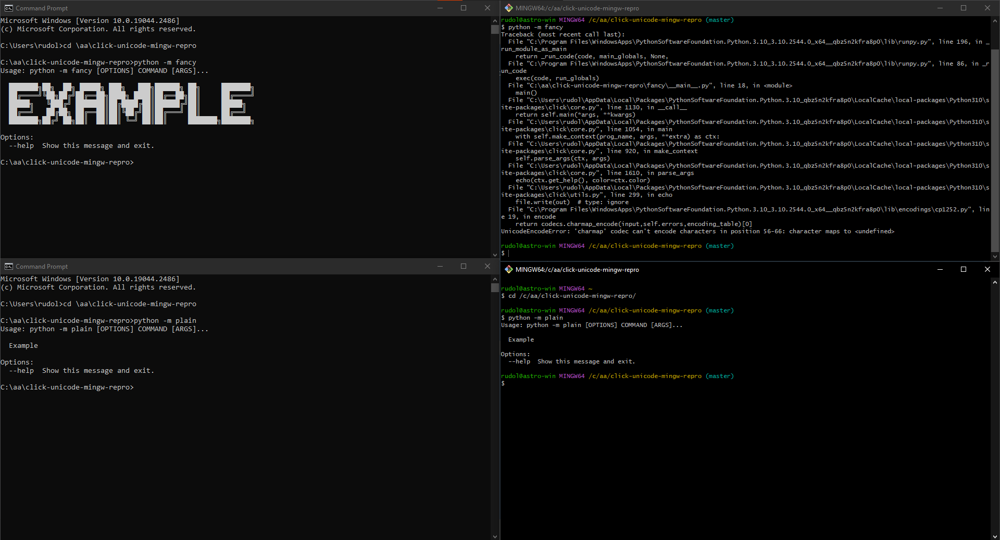

# Reproduction for `UnicodeEncodeError` in click

When I run a [`click`](https://click.palletsprojects.com/) command in [git bash](https://gitforwindows.org/) on Windows,
and it has unicode in the docstring, it breaks with `UnicodeEncodeError`.

## To reproduce

1. Clone this repo.
2. Install Git for Windows.
3. Open a "git bash" shell.
4. CD into the repo.
5. Run `python -m plain`. This works.
6. Run `python -m fancy`. This breaks.

Not that when you run this from the normal windows command line, both example work.

This is either a bug in `click` or in `git bash`. I'm not sure which.

## Screenshots



## The error

```
Traceback (most recent call last):
  File "C:\Program Files\WindowsApps\PythonSoftwareFoundation.Python.3.10_3.10.2544.0_x64__qbz5n2kfra8p0\lib\runpy.py", line 196, in _run_module_as_main
    return _run_code(code, main_globals, None,
  File "C:\Program Files\WindowsApps\PythonSoftwareFoundation.Python.3.10_3.10.2544.0_x64__qbz5n2kfra8p0\lib\runpy.py", line 86, in _run_code
    exec(code, run_globals)
  File "C:\aa\click-unicode-mingw-repro\fancy\__main__.py", line 18, in <module>
    main()
  File "C:\Users\rudol\AppData\Local\Packages\PythonSoftwareFoundation.Python.3.10_qbz5n2kfra8p0\LocalCache\local-packages\Python310\site-packages\click\core.py", line 1130, in __call__
    return self.main(*args, **kwargs)
  File "C:\Users\rudol\AppData\Local\Packages\PythonSoftwareFoundation.Python.3.10_qbz5n2kfra8p0\LocalCache\local-packages\Python310\site-packages\click\core.py", line 1054, in main
    with self.make_context(prog_name, args, **extra) as ctx:
  File "C:\Users\rudol\AppData\Local\Packages\PythonSoftwareFoundation.Python.3.10_qbz5n2kfra8p0\LocalCache\local-packages\Python310\site-packages\click\core.py", line 920, in make_context
    self.parse_args(ctx, args)
  File "C:\Users\rudol\AppData\Local\Packages\PythonSoftwareFoundation.Python.3.10_qbz5n2kfra8p0\LocalCache\local-packages\Python310\site-packages\click\core.py", line 1610, in parse_args
    echo(ctx.get_help(), color=ctx.color)
  File "C:\Users\rudol\AppData\Local\Packages\PythonSoftwareFoundation.Python.3.10_qbz5n2kfra8p0\LocalCache\local-packages\Python310\site-packages\click\utils.py", line 299, in echo
    file.write(out)  # type: ignore
  File "C:\Program Files\WindowsApps\PythonSoftwareFoundation.Python.3.10_3.10.2544.0_x64__qbz5n2kfra8p0\lib\encodings\cp1252.py", line 19, in encode
    return codecs.charmap_encode(input,self.errors,encoding_table)[0]
UnicodeEncodeError: 'charmap' codec can't encode characters in position 56-66: character maps to <undefined>
```
